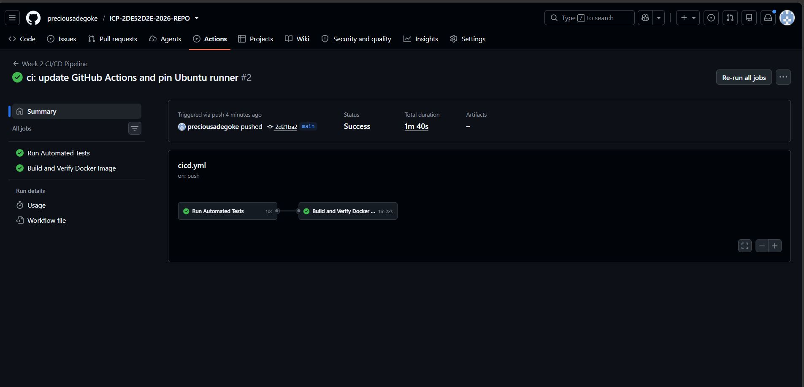
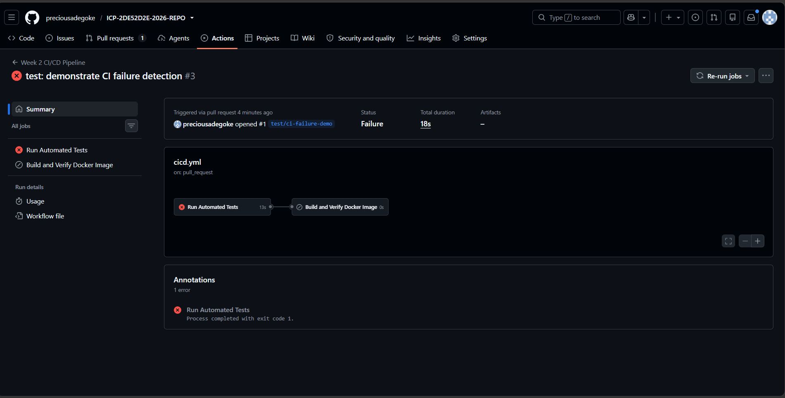
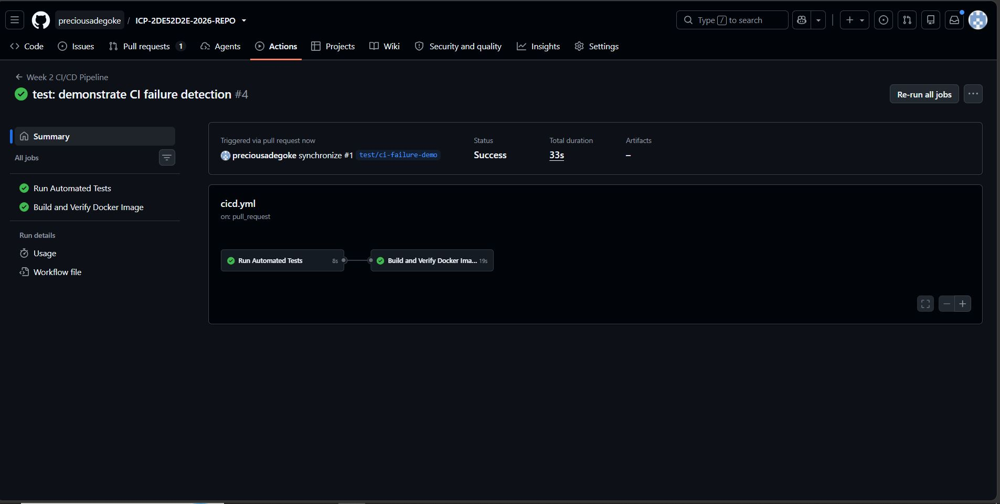
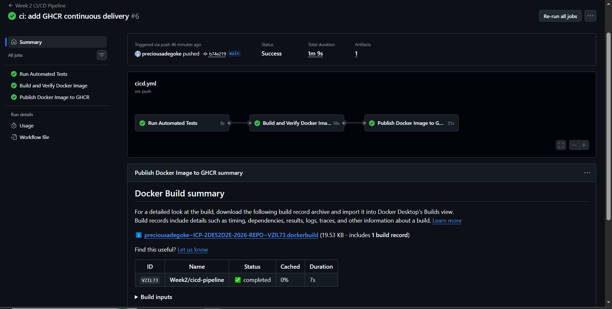
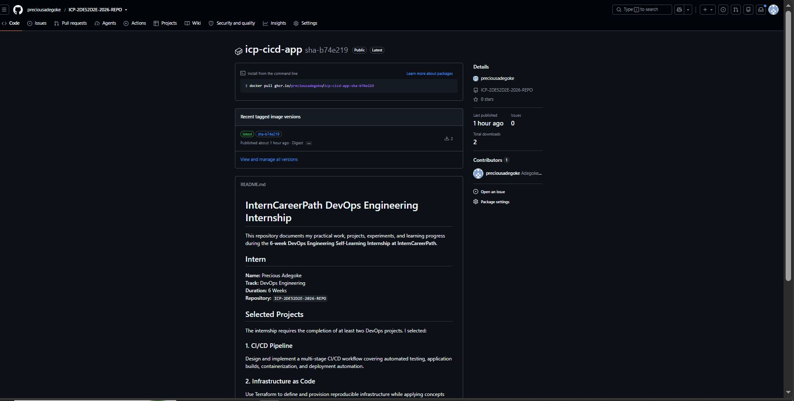
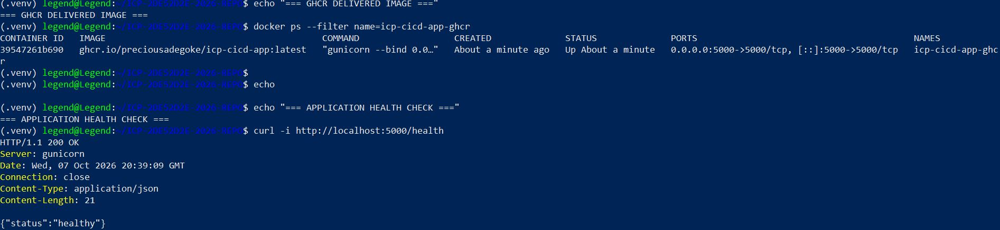

# Week 2 — CI/CD Pipeline Evidence

This directory contains supporting evidence for the CI/CD Pipeline implemented during **Week 2** of the InternCareerPath DevOps Engineering Internship.

The evidence demonstrates that the pipeline can automatically test the application, build and verify its Docker image, detect a regression, prevent dependent pipeline stages from proceeding after a test failure, and successfully recover after the problem is corrected.

---

## Evidence 1 — Successful CI Pipeline

### Description

The first stage of validation confirmed that the CI pipeline could successfully process a correct version of the application.

The GitHub Actions workflow was automatically triggered by a push to the `main` branch.

The pipeline executed two dependent jobs:

1. **Run Automated Tests**
2. **Build and Verify Docker Image**

The Docker job was configured to execute only after the automated test job completed successfully.

### Pipeline Flow

```text
Push to main
     |
     v
Run Automated Tests
     |
     | PASS
     v
Build Docker Image
     |
     v
Start Container
     |
     v
Verify /health Endpoint
     |
     v
Pipeline Success
```

### Evidence



### Result

The workflow completed successfully.

The automated testing job verified the Python application using `pytest`, while the Docker job:

- Built the application image
- Started a container from the image
- Exposed the application on port `5000`
- Checked the `/health` endpoint
- Confirmed that the application was healthy
- Collected container logs
- Stopped the test container

**Status:** Passed

---

## Evidence 2 — CI Regression Detection

### Description

A controlled failure test was performed to verify that the CI pipeline could detect a regression before an incorrect change was merged into the `main` branch.

A temporary branch named:

```text
test/ci-failure-demo
```

was created.

The expected HTTP status code in the health endpoint test was intentionally changed from the correct value:

```python
assert response.status_code == 200
```

to an incorrect value:

```python
assert response.status_code == 500
```

The change was submitted through a pull request targeting `main`.

### Expected Behaviour

The automated test stage was expected to fail because the `/health` endpoint correctly returned HTTP `200`, while the modified test incorrectly expected HTTP `500`.

Because the Docker job depends on the test job, the later Docker validation stage was not allowed to proceed after the automated tests failed.

### Pipeline Flow

```text
Pull Request
     |
     v
Run Automated Tests
     |
     X FAIL
     |
     v
Regression Detected
     |
     X
Docker Validation Blocked
```

### Evidence



### Result

The CI pipeline successfully detected the intentionally introduced regression.

This demonstrated that the workflow does not simply build every submitted change. It first validates the application through automated testing and prevents dependent stages from proceeding when those tests fail.

The intentionally failing change was **not merged into `main`**.

**Status:** Regression successfully detected

---

## Evidence 3 — CI Recovery

### Description

After confirming that the CI pipeline could detect the regression, the incorrect test assertion was restored to the expected HTTP `200` status code.

The automated tests were executed locally again and both tests passed before the corrected branch was pushed.

The updated pull request then passed the CI validation process.

### Recovery Flow

```text
Regression Detected
     |
     v
Correct Test Assertion
     |
     v
Run Local Tests
     |
     | PASS
     v
Push Correction
     |
     v
GitHub Actions
     |
     +----> Automated Tests PASS
     |
     +----> Docker Verification PASS
     |
     v
Pipeline Recovered
```

### Evidence



### Result

After the correction:

- The automated test job passed.
- The Docker image was built successfully.
- The container started successfully.
- The application health check passed.
- The complete workflow returned to a successful state.

The demonstration pull request was used only for CI validation and was not merged into `main`.

**Status:** Recovery verified

---

## CI/CD Validation Summary

| Validation | Purpose | Result |
|---|---|---|
| Local automated testing | Verify application behaviour before CI execution | Passed |
| Local Docker build | Verify container image creation | Passed |
| Local container execution | Verify the application runs inside Docker | Passed |
| Health endpoint verification | Verify application availability | Passed |
| GitHub Actions test job | Automatically execute tests after repository changes | Passed |
| Docker CI job | Build and validate the application container automatically | Passed |
| Controlled regression | Verify that CI detects incorrect application expectations | Detected |
| Job dependency | Prevent Docker validation after failed tests | Verified |
| Recovery validation | Verify successful pipeline execution after correction | Passed |

---

## Technologies Demonstrated

The Week 2 CI/CD implementation currently demonstrates practical use of:

- Git
- GitHub
- GitHub Actions
- Python
- Flask
- pytest
- Docker
- Gunicorn
- Bash/Linux
- HTTP health checks
- Pull request validation
- Automated regression detection

---

## Conclusion

The Week 2 CI/CD validation demonstrated both the successful and failure paths of an automated software delivery workflow.

Rather than validating only a successful build, the exercise confirmed that the pipeline can detect an incorrect change, stop dependent processing after test failure, and return to a successful state after the issue is corrected.

This provides evidence that the CI workflow functions as an automated quality gate for changes to the application.
---

## Evidence 4 — Successful Continuous Delivery Pipeline

### Description

After the Continuous Integration stages were validated, the workflow was extended with a Continuous Delivery stage that publishes a verified Docker image to the GitHub Container Registry (GHCR).

The delivery job is configured with:

```text
needs: docker
```

This means publication can occur only after:

1. The automated tests pass.
2. The Docker image is successfully built.
3. The application container starts successfully.
4. The `/health` endpoint passes verification.

The publish job is additionally restricted to pushes to the `main` branch. Pull request workflows can therefore validate proposed changes without publishing those changes as deliverable container images.

### Complete Pipeline Flow

```text
Push to main
     |
     v
Run Automated Tests
     |
     | PASS
     v
Build and Verify Docker Image
     |
     | PASS
     v
Publish Docker Image to GHCR
     |
     v
Continuous Delivery Success
```

### Evidence



### Result

GitHub Actions workflow run `37676215637` successfully completed all three jobs:

- Run Automated Tests
- Build and Verify Docker Image
- Publish Docker Image to GHCR

The publish job authenticated to GHCR using the workflow-provided `GITHUB_TOKEN`, generated Docker image metadata, built the production image, and published it to the registry.

**Status:** Passed

---

## Evidence 5 — Docker Image Published to GHCR

### Description

The Continuous Delivery stage publishes the verified application image to GitHub Container Registry.

The resulting container package is:

```text
ghcr.io/preciousadegoke/icp-cicd-app
```

Two tags are generated during publication:

```text
latest
sha-<commit>
```

For the validated delivery, the published tags were:

```text
latest
sha-b74e219
```

The `latest` tag provides a convenient reference to the most recently delivered image, while the SHA-based tag provides traceability between a container image and the source revision that produced it.

The package is associated with the InternCareerPath repository and is publicly accessible.

### Evidence



### Result

GitHub Container Registry successfully stored the application as a container package.

The registry reported the package:

```text
icp-cicd-app
```

with both the `latest` and commit-specific tags.

This confirms that the pipeline produces a persistent deployable artifact rather than only building a temporary image inside the CI runner.

**Status:** Container image successfully delivered to GHCR

---

## Evidence 6 — Delivered Artifact Runtime Verification

### Description

Publishing an image successfully does not by itself prove that the delivered artifact is usable.

For end-to-end verification, the image published by the Continuous Delivery pipeline was retrieved from GHCR and executed independently using Docker.

The delivered image was started using:

```bash
docker run --rm -d \
  --name icp-cicd-app-ghcr \
  -p 5000:5000 \
  ghcr.io/preciousadegoke/icp-cicd-app:latest
```

The running container was then verified through the application's health endpoint:

```bash
curl -i http://localhost:5000/health
```

### Evidence



### Result

The container created from the delivered GHCR image started successfully.

The health endpoint returned:

```text
HTTP/1.1 200 OK
```

with:

```json
{
  "status": "healthy"
}
```

The application was served by Gunicorn and remained operational inside the container.

This provides end-to-end evidence that the artifact generated and published by the delivery pipeline can subsequently be retrieved and executed successfully.

**Status:** Delivered artifact verified

---

## Complete CI/CD Architecture

```text
Developer Change
       |
       v
Git Push / Pull Request
       |
       v
GitHub Actions
       |
       v
Automated pytest Tests
       |
   +---+---+
   |       |
 FAIL     PASS
   |       |
   v       v
 Stop    Docker Build
           |
           v
      Start Container
           |
           v
       Health Check
           |
       +---+---+
       |       |
      FAIL    PASS
       |       |
       v       v
      Stop   Push to main?
               |
          +----+----+
          |         |
         NO        YES
          |         |
          v         v
       No Publish  Authenticate
                    to GHCR
                       |
                       v
                  Build & Publish
                       |
                       v
              GitHub Container Registry
                       |
                  +----+----+
                  |         |
                latest   sha-<commit>
```

Pull requests therefore function as validation workflows, while successful changes pushed to `main` can proceed through the complete Continuous Delivery path.

---

## Final CI/CD Validation Summary

| Validation | Purpose | Result |
|---|---|---|
| Local automated testing | Verify application behaviour before CI execution | Passed |
| Local Docker build | Verify container image creation | Passed |
| Local container execution | Verify application runtime | Passed |
| Local health verification | Verify application availability | Passed |
| GitHub Actions test job | Automatically execute tests after repository changes | Passed |
| Docker CI job | Build and verify the application container | Passed |
| Controlled regression | Verify CI detects an incorrect change | Detected |
| Job dependency | Prevent Docker validation after failed tests | Verified |
| CI recovery | Verify corrected changes return the workflow to success | Passed |
| GHCR authentication | Authenticate the delivery job without a manually stored PAT | Passed |
| Image metadata generation | Generate latest and source-traceable image tags | Passed |
| GHCR publication | Persist the verified Docker artifact in a registry | Passed |
| Main-branch delivery rule | Restrict artifact publication to pushes to `main` | Configured |
| Registry artifact retrieval | Retrieve the delivered container image from GHCR | Passed |
| Delivered artifact execution | Run the GHCR image independently | Passed |
| Delivered artifact health check | Verify the retrieved image responds correctly | Passed |

---

## Final Outcome

The Week 2 implementation now demonstrates a complete Continuous Integration and Continuous Delivery workflow.

Continuous Integration provides automated testing, Docker build validation, runtime health verification, regression detection, and dependent-job protection.

Continuous Delivery extends that process by publishing a verified and traceable Docker artifact to GitHub Container Registry after successful changes reach `main`.

The delivered artifact was subsequently retrieved from GHCR, executed independently, and verified through its HTTP health endpoint.

This demonstrates the complete path from source-code change to a tested, containerized, registry-hosted, and independently runnable software artifact.
